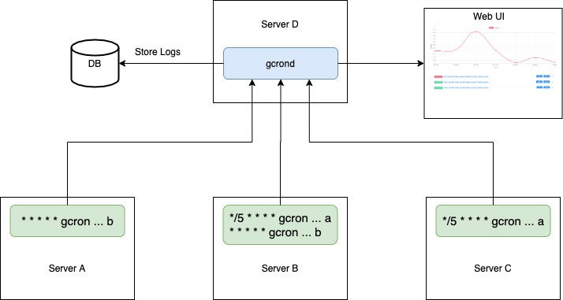
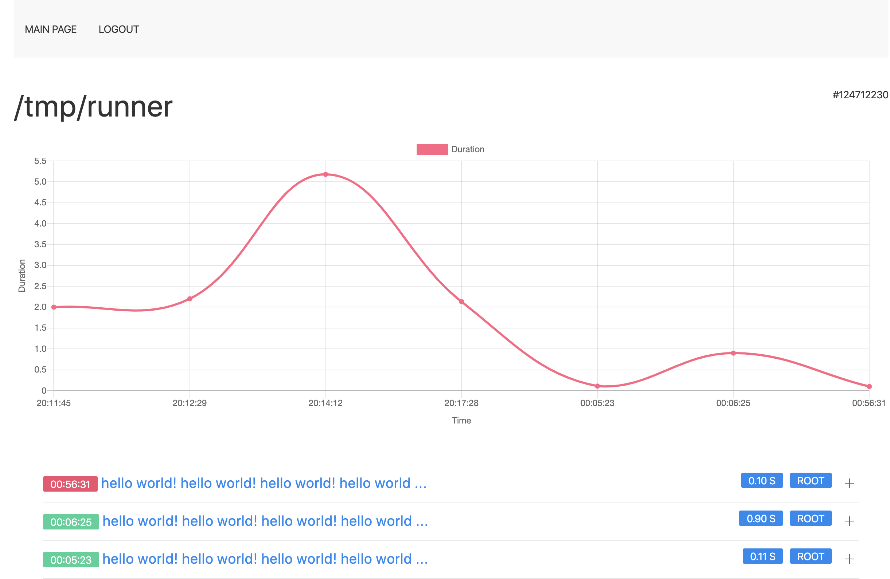

[](https://travis-ci.com/mbrostami/gcron)
[](https://goreportcard.com/report/github.com/mbrostami/gcron)
[  ](https://bintray.com/mbrostami/gcron/gcron/v2.0.3/link)
# gcron [In Development] 

### Features
- Skip a command's execution if the previous run is not completed yet
- Delay a command's execution
- Log a command's output plus stats (systime, usrtime, status, duration, ...)
- Override command status by using regex pattern
- Skip a command's execution if the previous run IN OTHER SERVER is not completed yet (gcrond)
- Centalize all logs in gcrond server  (gcrond)
- GUI server interface (gcrond)
- Duration graph in command page (gcrond)


### gcron IS NOT
- Cron job manager
- Job scheduler



# Install

Download one of the packages in release assets    
Install gcron (agent)   
`dpkg -i gcron_*_Tux_64-bit.deb`    


[Optional]   
If you  want to use GUI or centralized logging server   
Install gcrond (server)   
`dpkg -i gcrond_*_Tux_64-bit.deb`   


Configuration can be found in `/etc/gcron/gcron.yml` and `/etc/gcron/gcrond.yml`  

# Usage 
### gcron usage (agent)

```
gcron --help  

  --c                        (string) Command to execute
  
  --delay int                (int)    Delay running command in seconds
  
  --lock.enable              (bool)   Enable mutex lock
  --lock.name                (string) Custom mutex name
  --lock.remote              (bool)   Use rpc mutex lock
  --lock.timeout             (int)    Mutex timeout (default 60)
  
  --log.enable               (bool)   Enable log
  --log.level                (string) Log level (default "warning")
  
  --out.hide.duration        (bool)   Hide duration tag
  --out.hide.systime         (bool)   Hide system time tag
  --out.hide.uid             (bool)   Hide uid tag
  --out.hide.usertime        (bool)   Hide user time tag
  --out.tags                 (bool)   Output tags
  
  --override                 (string) Regex pattern to override command status (match in command output)
  
  --server.rpc.enable        (bool)   Enable using gcrond
  --server.rpc.host          (string) gcrond host
  --server.rpc.port          (string) gcrond port
```

### gcrond usage (server)

```
gcrond --help  

  --log.enable               (bool)   Enable log
  --log.level                (string) Log level (default "warning")
  --log.path                 (string) Log file location
  
  --server.rpc.host          (string) RPC Server host
  --server.rpc.port          (string) RPC Server port

  --server.web.host          (string) Web server host
  --server.web.port          (string) Web server port
```


# Examples

#### Delay running command  
```
gcron -c="echo HelloWorld" --delay=5
```  

#### Delay running command but avoid duplicate running  
```
gcron -c="echo HelloWorld" --delay=10 --lock.enable
```  

#### Mutex lock to prevent overlap same command  
```
gcron -c="sleep 61 && echo HelloWorld" --lock.enable
```   

#### Enable logging and log level  
```
gcron -c="echo HelloWorld" --log.enable --log.level=trace
``` 

#### Display tags (systime, usertime, duration, etc)  
```
gcron -c="echo HelloWorld" --log.level=info --out.tags
```

#### Override command status which is stored in tags.status [case sensitive]  
```
gcron -c="echo HelloWorld" --log.level=info --out.tags --override=".*World$"
gcron -c="echo HelloWorld" --log.level=info --out.tags --override=".*Worl$" 
```

#### Remote mutex lock to prevent overlap same command in multiple servers  
Server
```
gcrond --log.level=trace  
```
Client
```
gcron -c="echo Server1HelloWorld" --server.rpc.enable --lock.enable --lock.remote
```


#### Using gcron as cron
```
* * * * * gcron -c="echo Delay5seconds" --delay=5
* * * * * gcron -c="echo Delay5seconds" --delay=10
* * * * * gcron -c="echo Delay5seconds" --delay=15


* * * * * gcron -c="echo LocalLock" --lock.enable


* * * * * gcron -c="echo ServerLock" --server.rpc.enable --lock.enable --lock.remote
```  

# Screenshots
#### Main Page

#### Task Duration Graph

#### Task Details


## TODO

### gcron (agent)
- [ ] Cleaner code!!
- [X] Clean code
- [ ] Test
- [ ] Support different log formats for write/stream purpose 
- [ ] Ignore errors (Run command even if connection is not established)
- [x] Run cron after given seconds
- [x] Implement gRPC
- [x] Send output to remote server (tcp/udp/unix)
- [x] Configurable tags (mem usage, cpu usage, systime, usertime, ...) (flag/config)
- [x] Trackable id for logs
- [x] Optional Regex status (Accept regex to change status of the cron to false or true)
  - [x] By default exitCode of the cron command will be used to detect if command was successful or failed
- [x] Stream logs over rpc
- [x] Remote mutex lock
- [x] Local mutex
- [x] Remote lock based on command
- [x] Remote lock timeout
- [ ] Log rotation

### gcrond (server)
- [ ] Cleaner code!
- [ ] Write tests
- [x] Implement shared lock for clients
- [x] Migrate mutex from file locking to use db
- [x] Mutex client timeout
- [x] Pick high performance database to store all logs (search optimised, hash O(1) read support)
- [x] GUI
  - [x] Authentication
  - [x] Use FE framework (uikit, npm, webpack)
  - [ ] Search logs (tag, hostname, uid, command, guid, output)
  - [x] Bundle JS with webpack
  - [ ] Bundle CSS with webpack
  - [x] Command page duration graph
- [ ] Log stream proxy... (remote third party log server, REST Api, tcp/udp)
- [ ] TLS enabled over RPC
- [ ] Client authentication + (caching system)
- [ ] Async write (Get stream logs and write in database async)
- [ ] Handle connection timeouts
- [ ] Customized taging clientside
- [ ] Support different clients (syslog, ...)
- [ ] Fix casts int32 to int or int64 to int32
- [ ] Live reloading config file
- [ ] Log rotation / expire time

## FIXME
- Delete local lock file

## Development

`go run cmd/gcron/* -c="git status" --log.level=debug`   

`go run cmd/gcrond/* -log.level=trace`

